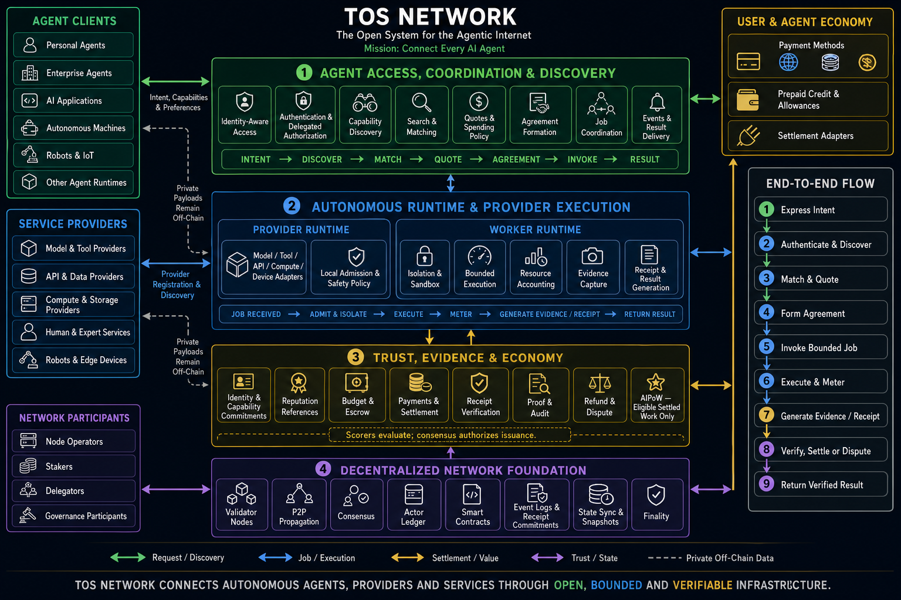

# TOS Network Whitepaper

**The Open System for the Agentic Internet**

**Foundational infrastructure for the Agentic Internet**

**Mission: Connect Every AI Agent.**

TOS Network is building open infrastructure through which autonomous agents operated by different people, organizations, and runtimes can discover one another, communicate, form precise commitments, execute within delegated limits, exchange evidence, and settle outcomes.

The primary lifecycle is:

```text
Identity -> Discovery -> Intent -> Negotiation -> Agreement
         -> Bounded Execution -> Evidence / Receipt -> Settlement
```

An **Intent** is a revocable expression of a desired outcome. It does not by itself create an obligation or authorize spending. An **Agreement** is the exact, authenticated set of terms accepted by the relevant parties. One or more typed **Agentic Service Operations** can then execute that Agreement under explicit capability, resource, budget, evidence, and settlement rules.

## TOS Network architecture

TOS Network is one system composed of four interoperable infrastructure layers, surrounded by the participants and economies that use them:



1. **Agent Access, Coordination and Discovery** - identity-aware access, authentication, delegated authorization, capability publication and search, matching, quoting, spending policy, Agreement formation, job coordination, events, and result delivery.
2. **Autonomous Runtime and Provider Execution** - agent, provider, and worker runtimes; model, tool, API, compute, and device adapters; isolated execution; local admission and safety policy; resource accounting; Evidence, Receipt, and result generation.
3. **Trust, Evidence and Economy** - identity and capability commitments, reputation references, escrow, payment, Receipt verification, proof, dispute, refund, settlement, and optional demand-aligned contribution incentives.
4. **Decentralized Network Foundation** - validators, peer-to-peer propagation, consensus, the actor ledger, smart contracts, event logs, state synchronization, snapshots, and finality.

Users, personal and enterprise agents, autonomous applications, machines, and service buyers enter through the access layer. Model, API, compute, storage, human, and physical-service providers connect through the runtime layer. Node operators, stakers, and governance participants maintain the decentralized foundation.

Four flows cross the architecture:

```text
Request / Discovery: participant <-> access and coordination
Job / Execution:     coordination <-> provider runtime
Settlement / Value:  runtime and coordination <-> trust and economy
Trust / State:       trust and economy <-> decentralized foundation
```

Private payloads and execution remain off-chain. Only the authority, commitments, evidence, disputes, and economic outcomes required by the accepted policy cross the shared trust boundary. A gateway may route, an index may rank, a runtime may execute, and a scorer may evaluate, but none can silently create owner authority or declare settlement final.

The common end-to-end path is:

```text
Intent -> Authenticate -> Discover -> Match -> Quote -> Agreement
       -> Invoke -> Bounded Execution -> Evidence / Receipt
       -> Verify -> Settle or Dispute -> Return Result
```

When AIPoW is active, it consumes only separately eligible, evidence-graded, settled work after this path. It does not authorize requests, replace ordinary payment, or permit an off-chain scorer to mint value.

## Agentic operations

An **Agentic Service Opcode** is a service-layer architectural term, not a TVM instruction. The normative protocol field is `operation_id`. Operations are versioned, typed, authorized, metered, receipted, and settleable.

Metering does not require a non-zero fee. Allowances, subscriptions, sponsorship, prepaid capacity, batched settlement, and refundable bonds are valid policies. The invariant is that externally imposed cost remains bounded, attributable, and enforceable.

Private payloads and execution can remain off-chain. TOS is used where shared identity, authority, commitments, receipts, disputes, or final settlement require a tamper-resistant source of truth.

## Investor materials

- [Investor comparison](INVESTOR_COMPARISON.md)

## Repository contents

- `tos.tex` - LaTeX source for the whitepaper
- `tos.pdf` - compiled PDF edition
- `LICENSE.md` - GNU General Public License v3.0

## Build the PDF

From this directory, compile twice so the table of contents and cross-references resolve:

```bash
pdflatex -interaction=nonstopmode -halt-on-error tos.tex
pdflatex -interaction=nonstopmode -halt-on-error tos.tex
```

## Document status

This whitepaper separates released foundations from architectural direction:

- **Implemented**: a released node, contract, tool, or test foundation exists.
- **Partial**: useful primitives or a profile-specific implementation exists, while the common interoperable surface remains incomplete.
- **Planned**: specification, implementation, conformance testing, and independent review remain required.

These labels do not imply production readiness, external audit, commercial availability, adoption, or legal approval. Protocol behavior is defined by released code, schemas, and accepted network rules, not by prose alone.

## License

Copyright (C) 2025-2026 TOS Network.

This work is licensed under the [GNU General Public License v3.0](https://www.gnu.org/licenses/gpl-3.0.html).
